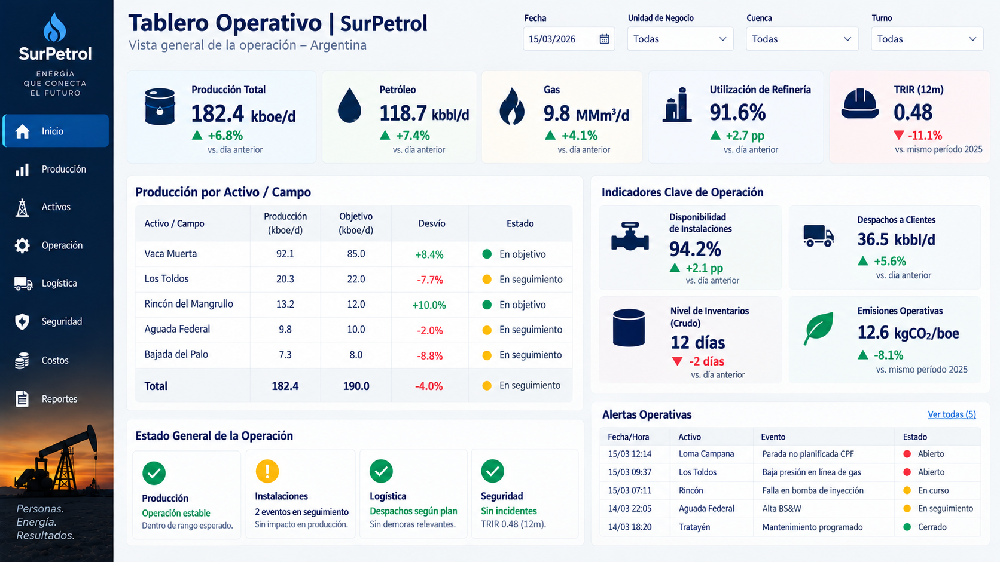

# SurPetrol - Upstream Real-Time Operational Performance & Field Asset Monitoring

Solución integral de Business Intelligence operativa desarrollada para la Direccion de Operaciones de **SurPetrol**. El sistema centraliza la telemetría diaria de boca de pozo, el despacho de fluidos (crudo, gas y agua producida), el monitoreo de instalaciones de superficie (CPF y baterías) y la gestión de intervenciones de torre (Workover y Perforación) para los bloques concesionados en cuencas productoras (Vaca Muerta, Los Toldos, Rincón del Mangrullo, entre otros). Nombre Ficticio y datos extraidos de Kaggle.com 

---

## 📊 Tablero Operativo Diario



> **Monitoreo Diario (15/03/2026):** Visibilidad unificada de volumen diario (`kboe/d`), corte de agua producida (`kbbl/d`), disponibilidad técnica de instalaciones, matriz de estado de 412 pozos y panel de criticidad de eventos/paradas no planificadas.

---

## 📌 Escenario de Negocio y Requerimientos

La operación distribuida en múltiples campos presentaba una brecha de visibilidad entre la telemetría en tiempo real de campo y la toma de decisiones del equipo de producción y mantenimiento:

- **Desfasaje en el balance de fluidos:** Falta de correlación inmediata entre el petróleo neto producido y el incremento de agua asociada (`48.3 kbbl/d`, +12.6% vs. día anterior), lo que satura las plantas de inyección de agua y oleoductos[cite: 10].
- **Seguimiento fragmentado del parque de pozos:** La gestión de pozos cerrados (40 pozos, 9.7% del total) y activos en intervención (Workover/Pulling) se administraba en planillas desconectadas, retrasando la detección de pérdidas de producción diferida[cite: 10].
- **Gestión reactiva de paradas de planta:** Inexistencia de un semáforo centralizado de fallas críticas (ej. paradas no planificadas en CPF o alertas de alta BS&W) para priorizar despachos de cuadrillas de mantenimiento[cite: 10].

---

## 🛠️ Stack Tecnológico

- **Business Intelligence & Reporting:** Power BI Desktop / Power BI Service (DirectQuery / Scheduled Refresh con Gateway corporativo).
- **Modelado de Datos:** Esquema en Estrella balanceado (*Star Schema*) optimizado para alto rendimiento en filtros cruzados temporales y jerarquías geográficas de activos[cite: 10].
- **Ingeniería de Datos:** Ingesta y normalización desde bases de telemetría SCADA / historian (OSIsoft PI / Wonderware) y sistemas de despacho de producción (Energy Components / Fieldview) mediante SQL.
- **Lógica Analítica:** DAX para cálculo de BOE dinámico, variaciones interdiarias (*Day-over-Day*), ratios de disponibilidad operacional y ventanas móviles de seguridad HSE (TRIR)[cite: 10].

---

## 📐 Arquitectura del Modelo de Datos

- **Tablas de Hechos (Fact Tables):**
  - `Fact_Produccion_Diaria_Pozo`: Medición fiscalizada diaria de crudo (`kbbl/d`), gas natural (`MMm³/d`) y agua producida (`kbbl/d`)[cite: 10].
  - `Fact_Estado_Pozos_Snapshot`: Histórico diario del estado operativo de cada pozo (Produciendo, Cerrado, En Perforación, En Workover)[cite: 10].
  - `Fact_Instalaciones_KPI`: Registro por instalación de capacidad de procesamiento, throughput actual y % de disponibilidad mecánica[cite: 10].
  - `Fact_Alertas_Operativas`: Log transaccional de eventos SCADA, criticidad, tiempo de resolución y estado (Abierto, En curso, En seguimiento, Cerrado)[cite: 10].
  - `Fact_Cronograma_Intervenciones`: Planificación de servicios de torre, fractura, completación y limpiezas programadas[cite: 10].

- **Dimensiones Conformadas:**
  - `Dim_Campos_Activos`: Jerarquía Cuenca → Concesión / Bloque → Campo / Yacimiento → Batería / CPF[cite: 10].
  - `Dim_Pozos`: Padrón único de pozos (UWI/API), método de elevación artificial (Gas Lift, PCP, Bombeo Mecánico) y formación objetivo[cite: 10].
  - `Dim_Instalaciones`: Infraestructura de superficie (CPF, Plantas de Gas, Estaciones de Bombeo, Plantas de Inyección de Agua)[cite: 10].
  - `Dim_Calendario`: Dimensión temporal estándar con granularidad día y corte de turno operativo (Turno Día / Noche)[cite: 10].

---

## 🧠 Desafíos Técnicos Resueltos en DAX & Modelado

### 1. Estandarización de Barriles Equivalentes de Petróleo (BOE)
Para unificar la producción fiscalizada de crudo y gas natural en una única métrica estándar (`kboe/d`), se implementó la fórmula técnica de conversión por poder calorífico ($1\text{ BOE} \approx 5.8\text{ MCF}$ o factor regional en $m^3$):

```dax
Produccion_Total_kboe_d = 
VAR _Petroleo_kbbl = [Total_Petroleo_kbbl_d]
VAR _Gas_MMm3 = [Total_Gas_MMm3_d]
-- Factor de conversión: 1 Mm3 gas ~ 6.29 boe (según estándar operativo de cuenca)
VAR _Gas_kboe = (_Gas_MMm3 * 1000 * 6.2898) / 1000
RETURN 
    _Petroleo_kbbl + _Gas_kboe
